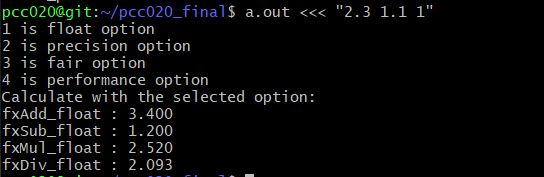
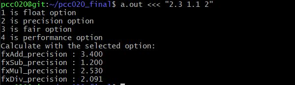
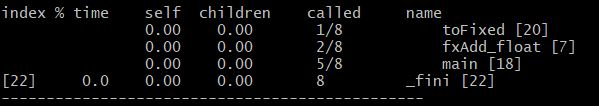
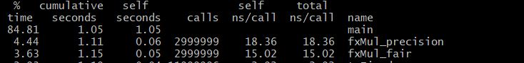
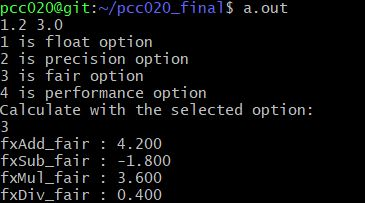

# pcc020_final fx_s4_3
## 실전코딩2 - 기말과제

### 프로젝트 주제
* 아주고정소수점 라이브러리 개발.
* 아주대학교의 임베디드 시스템을 위한 고정소수점 수학 라이브러리 개발.
* pcc020의 경우 S4_3을 할당 받았기 때문에 1111.111인 15.875 ~ -16.875까지의 숫자를 표현할 수 있어야 한다.
#
### 고정소수점과 부동소수점
* 고정소수점 표현 방식이라는 것은 쉽게 말해 10진수를 2진수로 변환하고 그것을 그대로 박아 넣는 방식이다.
* 부동소수점 표현 방식은 2진수로 변환한 결과를 그대로 박아넣지 않고 몇 가지 과정을 추가로 거친다.
* 과정 중 하나를 정규화라고 하는데정수부에 1만 남을 때까지 소수점을 왼쪽 (*정수부가 0일 경우엔 오른쪽. 아래에서 다시 설명) 으로 이동시키고 이동한 칸 수만큼 n 자리에 집어넣으면 된다. 예를 들어서 111.101을 정규화하면 1.11101 * 2^2가 된다.
>* IEEE 754: IEEE 754의 부동소수점 표현은 크게 세 부분으로 구성되는데, 최상위 비트는 부호를 표시하는 데 사용되며, 지수 부분(exponent)과 가수 부분(fraction/mantissa)이 있다.
>* −118.625(십진법)를 IEEE 754(32비트 단정밀도)로 표현해 보자.
음수이므로, 부호부는 1이 된다.
그 다음, 절댓값을 이진법으로 나타내면 1110110.101(2)이 된다. 소수점을 왼쪽으로 이동시켜, 왼쪽에는 1만 남게 만든다. 예를 들면 1110110.101(2)=1.110110101(2)×2⁶ 과 같다. 이것을 정규화된 부동소수점 수라고 한다.
가수부는 소수점의 오른쪽 부분으로, 부족한 비트 수 부분만큼 0으로 채워 23비트로 만든다. 결과는 11011010100000000000000 이 된다.
지수는 6이므로, Bias를 더해야 한다. 32비트 IEEE 754 형식에서는 Bias는 127이므로 6+127 = 133이 된다. 이진법으로 변환하면 10000101(2)이 된다.
>* 
#
### fxAdd_float, fxSub_float, fxMul_float, fxDiv_float 구현
* 어떤 데이터 타입을 정의하기 위해 toFixed라는 함수를 사용한다. S4_3의 경우 3의 소수점을 가지고 있다. 그렇기에 기초적인 생각은 toFixed라는 함수에서 소수점의 개수인 3만큼 << 연산을 실행하고 사칙연산을 수행하면 된다.
* 총 8비트의 연산을 수행하기에 a,b의 값은 int로 받지만 127~-128만 받을 수 있도록 했다.
* 덧셈의 경우 소수점이 n만큼 있고 a, b가 입력된다고 생각하면 a/n + a/b = (a+b)/n 이기에 a+b에 <<3을 하면 정상적인 계산이 이루어진다.  
* 뺄셈의 경우 소수점이 n만큼 있고 a, b가 입력된다고 생각하면 a/n - b/n = (a-b)/n 이 된다. 덧셈과 마찬가지로 a-b에 <<3을 해주면 정상적인 계산이 이루어진다.
* 곱셈의 경우부터 조금 특별해진다. a/n x b/n = (a x b)/(n x n) 이기 때문에 a,b에 각각 << n 해주고 곱셈 연산 뒤 >> n 을 두번 해주어야 한다.
* 나눗셈의 경우 a/n / b/n 의 연산을 수행할 경우 a, b에 n만큼 <<연산을 해준 후 나눗셈을 해주면 된다. n이 자동으로 만나 사라진다.
* 하지만 2.3 1.15의 연산을 수행한다고 생각해보자. 2.3은 2진수로 표현하면 10.010011001100110011..이 된다. 그렇기 때문에 S4_3의 소수점인 3만큼만 이동을 할 경우 너무 큰 오차가 발생하게 된다. 그래서 a, b를 float 자료형으로 선언 후 넣어준 뒤, toFixed 함수에서 <<8을 해주어 오차율을 줄였다.
* 그렇게 되면 15.875 초과이거나 -16.875미만일 경우도 작동하게 되어 제작 의도를 벗어나게 된다. 그래서 main.c 파일에 if 문을 통해 주어진 값에서만 작동하도록 소스코드를 작성하였고, printf에 %.3f으로 출력함으로써 제작 의도를 충족시켰다.
* 덧셈, 뺄셈은 각각 fxAdd_float과 fxSub_float에서 변수의 형태룰 double로 함수에 받았기 때문에 단순 계산 후 반환하여 출력하였고, 곱셈과 나눗셈의 경우 앞서 서술한 공식을 반영하여 작성했다. 
* main.c에서 fxMul_float을 보면 ``` fxMul_float(toFixed(a),toFixed(b))``` 가 계산되어 출력되는 것을 볼 수 있는데 이때 a,b에 각각 << 8 이 일어나고 fxMul_float 함수에 들어가 곱해진 뒤 256이 나누어지고 실수형 변수 처리가 된 후, 다시 256이 나눠져서 반환되는 것을 볼 수 있다. 
* 같은 방식으로 main.c에서 fxDiv_float을 보면 ```fxDiv_float(toFixed(a),toFixed(b))```가 계산되어 출력되는 것을 볼 수 있는데 이때 a,b에 각각 << 8 이 일어나고 fxDiv_float 함수에 들어가 flaot 형식으로 재 정의되어 나눠지는 것을 알 수 있다.
#

### fxAdd_precision, fxSub_precision, fxMul_precision, fxDiv_precision 구현
* 앞서 fx_float 연산에서는 <<8 만큼 shift 연산을 수행하여 값을 구현했습니다. 


* 위 두개의 사진은 각각 float 옵션과 precision 옵션으로 2.3 과 1.1을 사칙연산을 수행한 것이다. 사진을 보면 덧셈과 나눗셈까지는 값이 같지만 곱셈과 나눗셈의 결과값이 다른 것을 알 수 있다.
* 이런 결과 값이 나오는 이유는 위에 서술되어 있는 것처럼 << 연산이 수행될 때의 차이 때문에 발생한다. 앞서 2.3의 이진수는 010011001100110011..라고 말했었다. 우리는 2.3을 10진수의 형태로 입력했지만, 컴퓨터는 이진수의 형태로 받았고 << 연산 시 미쳐 << 연산이 되지 못한 소수점의 1들이 long 자료형으로 선언됐을 때 소실되어 값이 소실되는 것이다.
* 실제로 2.3 / 1.1 을 일반 계산기에서 계산했을 때는 곱셈시 2.53, 나눗셈시 2.0909090909가 나온다. 곱셈시 float에서는 2.520가 나오고 precision에서는 2.530이 나오는 것을 보아 precision이 정확한 연산을 수행한다고 볼 수 있다. 나눗셈시 에도 float 계산결과가 2.093, precision은 2.091이 나오므로 나눗셈 연산도 precision이 정확한 것을 알 수 있다.

#

### fxAdd_fair, fxSub_fair, fxMul_fair, fxDiv_fair 구현
* fair은 performance와 값은 같지만 연산이 조금 더 빠르도록 코드를 작성했다.
* 하지만 gprof로 디버깅 한 결과 아래 사진과 같이 전부 다 0으로 표기되었다.

* fair은 기존에 toFixed 함수에서 진행되었던 shift 연산을 매크로 함수로 진행하여 연산 속도를 높이고자 했다.
>* 함수 호출과 연산속도 관계
>* 함수가 호출되면 우선 스택에 함수로 전달할 매개변수와 함께 호출이 끝난 뒤 돌아갈 반환 주소값을 저장하게 됩니다. 그리고서 프로그램의 제어가 함수의 위치로 넘어와 함수 내에 선언된 지역 변수도 스택에 저장합니다. 그때부터 함수의 모든 코드를 실행하게 되고, 실행이 전부 끝나면 반환값을 넘겨 줍니다. 그 후 프로그램의 제어는 스택에 저장된 돌아갈 반환 주소값으로 이동하여, 스택에 저장된 함수 호출 정보를 제거합니다. 이와 같은 일련의 함수 호출 과정이 함수마다 일어나게 됩니다.
>* 함수를 한번 호출할 때마다 저런 과정이 일어나므로 이런 과정을 줄여 속도를 높이고자 하였다.
* 위와 같이 기존 코드로는 차이를 나타낼 수 없어 main2.c 를 만들어 기존 계산을 1~3000000의 숫자들을 계산하는 반복문을 넣어 다시 컴파일 하였다. 아래 사진과 같이 precision과 fair 연산에서 Fixed 과정을 함수 호출을 통해 구현했는지, macro 함수로 구현했는지에 따라 속도 차이가 나타나는 것을 확인할 수 있다. 

#

### fxAdd_performance, fxSub_performance, fxMul_performance, fxDiv_performance 구현
* performance의 경우 fair 과정에서 한 단계 더 나아가 add, sub, mul, div 모든 과정을 
>* ```#define PLUS_16 65536``` ```#define MINUS_16 1/65536```
>* ```#define FIXED_(a) (((double)(a))*65536)``` 
>* ```#define fx_Div_performance(a) ((double)(a))``` 
>* ```#define fx_Mul_performance(a,b) (((long double)(a*b)/65536)/65536)```
>* 와 같이 macro 함수를 선언함으로써 연산속도를 높였다.

#

### if 문을 통한 계산 옵션 추가
* main.c에 printf 와 if 문을 추가하여 계산 옵션을 추가하여 실행시 아래 사진과 같이 선택할 수 있도록 구현했다.


### 라이브러리 제작
* 라이브러리란?
    * 소프트웨어를 만들 때 쓰이는 클래스나 서브루틴들의 모임을 가리키는 말이다.
    * 다른 프로그램들과 링크되기 위하여 존재하는, 하나 이상의 서브루틴(subroutine)이나 함수(function)들의 집합 파일이다.
    * 링크(link)될 수 있도록 보통 컴파일된 형태인 목적 코드(object code)형태로 존재한다.
    * 미리 컴파일 되어 있어서 컴파일 시간도 단축된다.
1. cc -c 를 통해서 오브젝트 파일을 생성한다.
```
cc -c main.c fx_s4_3.c
```
2. 두개의 오브젝트를 하나의 라이브러리로 통합한다.
```
#gcc -shared -Wl,-soname,libmy.so.0 -o libmy.so.0.0.0 main.o fx_s4_3.o
```
* shared 는 공유 라이브러리를 사용해서 링크 하라는 옵션이다.
* Wl 는 뒤에 오는 옵션들을 링커(collect2) 에게 gcc 를 거치지 않고 바로 전달 하라는 옵션이다.
* soname 은 실제 만들 라이브러리인 libmy.so.0.0.0 에 libmy.so.0 이라는 soname 을 생성하여 나중에 동적링크(/lib/ld-linux.so.2)가 공유 라이브러리를 찾을때 libmy.so.0.0.0 을 찾는게 아니라 soname 인 libmy.so.0 를 찾아 링크 하도록 한다. 버전 관리를 융통성 있게 하기 위함이며, 실제 gcc 가 링크 하는 파일명은 버전 정보가 없는 libmy.so 를 상요 하며, 이또한 libmy.so0.0.0 의 링크 파일로 만들어 사용 하는 것이다.

3. 링크 파일을 생성한다.
```
ln -s libmy.so.0.0.0 libmy.so
ln -s libmy.so.0.0.0 libmy.so.0
```

4. 라이브러리를 사용하도록 컴파일한다.
```
cc -o fixed main.c 
```


### 소스코드 모음 [fx_s4_3.c] [fx_s4_3.h] [fx_head.h] [main.c]
```
// S4.3 fx_s4_3.c
#include "fx_s4_3.h"
#include "fx_head.h"
typedef long FIXED;
typedef long long _FIXED;
#define fxADD(a,b) ((a)+(b))
#define fxSUB(a,b) ((a)-(b))

//float function
FIXED toFixed(double a)
{
        a = a*PLUS_8;
        return a;
}
float fxAdd_float(double a,double b)
{
        return fxADD(a,b);
}

float fxSub_float(double a, double b)
{
        return fxSUB(a,b);
}

float fxMul_float(FIXED a,FIXED b)
{
        float c = (a*b)*MINUS_8;
        return c*MINUS_8;
}

float fxDiv_float(FIXED a, FIXED b)
{
        float c = a;
        float d = b;
        return c/d;
}

//precision function
_FIXED toFixed_pre(double a)
{
        _FIXED c;
        c = a*PLUS_16;
        return c;
}
float fxAdd_precision(double a,double b)
{
        return fxADD(a,b);
}

float fxSub_precision(double a, double b)
{
        return fxSUB(a,b);
}

long double fxMul_precision(_FIXED a,_FIXED b)
{
        long double c = (a*b)*MINUS_16;
        return c*MINUS_16;
}

double fxDiv_precision(_FIXED a, _FIXED b)
{
        double c = a;
        double d = b;
        return c/d;
}

//fair function
float fxAdd_fair(double a,double b)
{
        return fxADD(a,b);
}

float fxSub_fair(double a, double b)
{
        return fxSUB(a,b);
}

long double fxMul_fair(_FIXED a,_FIXED b)
{
        long double c = (a*b)*MINUS_16;
        return c*MINUS_16;
}

long double fxDiv_fair(_FIXED a, _FIXED b)
{
        double c = a;
        double d = b;
        return c/d;
}


//performance function only calculated by ppc
```
```
// main.c
#include <stdio.h>
#include "fx_s4_3.h"
int main()
{
        float a,b;
        int c;
        fscanf(stdin,"%f %f", &a, &b);
        fprintf(stdout,"1 is float option\n");
        fprintf(stdout,"2 is precision option\n");
        fprintf(stdout,"3 is fair option\n");
        fprintf(stdout,"4 is performance option\n");
        fprintf(stdout,"Calculate with the selected option:\n");
        fscanf(stdin,"%d", &c);
        if( a > 127 || a < -128)
        {
                return 0;
        }
        if (b > 127 || b < -128)
        {
                return 0;
        }

        if(c == FX_OP_FLOAT)
        {
        // float
        if(fxAdd_float(a,b)<15.875 || fxAdd_float(a,b)>-16.875)
        {
        fprintf(stdout,"fxAdd_float : %.3f\n", fxAdd_float(a,b));
        }
        if(fxSub_float(a,b)<15.875 || fxSub_float(a,b)>-16.875){
        fprintf(stdout,"fxSub_float : %.3f\n", fxSub_float(a,b));
        }
        if(fxMul_float(a,b)<15.875 || fxMul_float(a,b)>-16.875){
        fprintf(stdout,"fxMul_float : %.3f\n", fxMul_float(toFixed(a), toFixed(b)));
        }
        if(fxDiv_float(a,b)<15.875 || fxDiv_float(a,b)>-16.875){
        fprintf(stdout,"fxDiv_float : %.3f\n", fxDiv_float(toFixed(a), toFixed(b)));
        }
        }

        if(c == FX_OP_PRECISION)
        {
        // precision
        if(fxAdd_precision(a,b)<15.875 || fxAdd_precision(a,b)>-15.875)
        {
        fprintf(stdout,"fxAdd_precision : %.3f\n", fxAdd_precision(a,b));
        }
        if(fxSub_precision(a,b)<15.875 || fxSub_precision(a,b)>-15.875)
        {
        fprintf(stdout,"fxSub_precision : %.3f\n", fxSub_precision(a,b));
        }
        if(fxMul_precision(a,b)<15.875 || fxMul_precision(a,b)>-15.875)
        {
        fprintf(stdout,"fxMul_precision : %.3Lf\n", fxMul_precision(toFixed_pre(a), toFixed_pre(b)));
        }
        if(fxDiv_precision(a,b)<15.875 || fxDiv_precision(a,b)>-15.875){
        fprintf(stdout,"fxDiv_precision : %.3lf\n", fxDiv_precision(toFixed_pre(a), toFixed_pre(b)));
        }
        }

        if(c == FX_OP_FAIR)
        {
        // fair
        if(fxAdd_fair(a,b)<15.875 || fxAdd_fair(a,b)>-16.875)
        {
        fprintf(stdout,"fxAdd_fair : %.3f\n", fxAdd_fair(a,b));
        }
        if(fxSub_fair(a,b)<15.875 || fxSub_fair(a,b)>-16.875)
        {
        fprintf(stdout,"fxSub_fair : %.3f\n", fxSub_fair(a,b));
        }
        if(fxMul_fair(a,b)<15.875 || fxMul_fair(a,b)>-16.875)
        {
        fprintf(stdout,"fxMul_fair : %.3Lf\n",fxMul_fair(FIXED_(a),FIXED_(b)));
        }
        if(fxDiv_fair(a,b)<15.875 || fxDiv_fair(a,b)>-16.875)
        {
        fprintf(stdout,"fxDiv_fair : %.3Lf\n", fxDiv_fair(FIXED_(a),FIXED_(b)));
        }
        }

        if(c == FX_OP_PERFORMANCE)
        {
        // performance
        if(fxADD(a,b)<15.875 || fxADD(a,b)>-16.875)
        {
        fprintf(stdout,"fxAdd_performance : %.3f\n", fxADD(a,b));
        }
        if(fxSUB(a,b)<15.875 || fxSUB(a,b)>-16.875)
        {
        fprintf(stdout,"fxSub_performance : %.3f\n", fxSUB(a,b));
        }
        if(fx_Mul_performance(FIXED_(a),FIXED_(b))<15.875 || fx_Mul_performance(FIXED_(a),(b))>-16.875)
        {
        fprintf(stdout,"fxMul_performance : %.3Lf\n",fx_Mul_performance(FIXED_(a),FIXED_(b)));
        }
        if(fx_Div_performance(FIXED_(a))/fx_Div_performance(FIXED_(b))<15.875 || fx_Div_performance(FIXED_(a))/fx_Div_performance(FIXED_(b))>-16.875)
        {
        fprintf(stdout,"fxDiv_performance : %.3lf\n", fx_Div_performance(FIXED_(a))/fx_Div_performance(FIXED_(b)));
        }
        }
        return 0;
}


```
```
// fx_s4_3.h
typedef long FIXED;
typedef long long _FIXED;
extern FIXED toFixed(double a);
extern _FIXED toFixed_pre(double a);
#include "fx_head.h"
#include <math.h>
extern float fxAdd_float(double a, double b), fxAdd_precision(double a, double b), fxAdd_fair(double a, double b);
extern float fxSub_float(double a, double b), fxSub_precision(double a, double b), fxSub_fair(double a, double b);
extern float fxMul_float(FIXED a, FIXED b);
extern long double fxMul_precision(_FIXED a, _FIXED b), fxMul_fair(_FIXED a, _FIXED b),fxDiv_fair(_FIXED a, _FIXED b);
extern float fxDiv_float(FIXED a, FIXED b);
extern double fxDiv_precision(_FIXED a, _FIXED b);
```
```
//fx_head.h
#define fxADD(a,b) ((a)+(b))
#define fxSUB(a,b) ((a)-(b))
#define PLUS_8 256
#define MINUS_8 1/256
#define PLUS_16 65536
#define MINUS_16 1/65536
#define FIXED_(a) (((double)(a))*65536)
#define fx_Div_performance(a) ((double)(a))
#define fx_Mul_performance(a,b) (((long double)(a*b)/65536)/65536)

// Operation Preference
#define FX_OP_FLOAT 1
#define FX_OP_PRECISION 2
#define FX_OP_FAIR 3
#define FX_OP_PERFORMANCE 4

```
